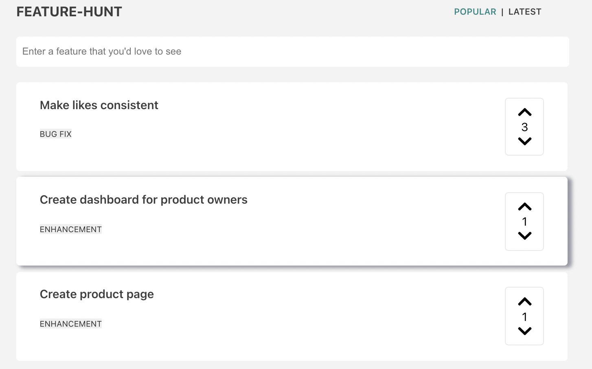
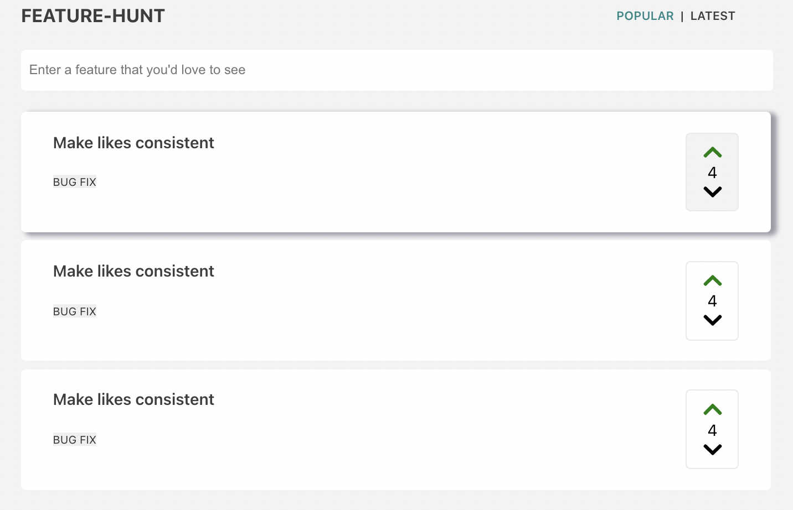
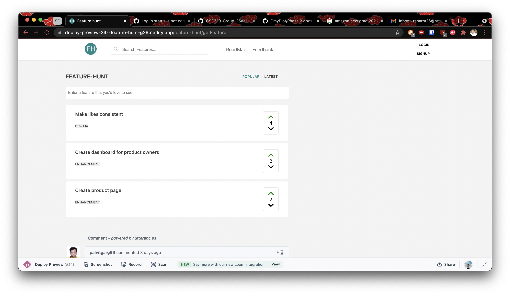
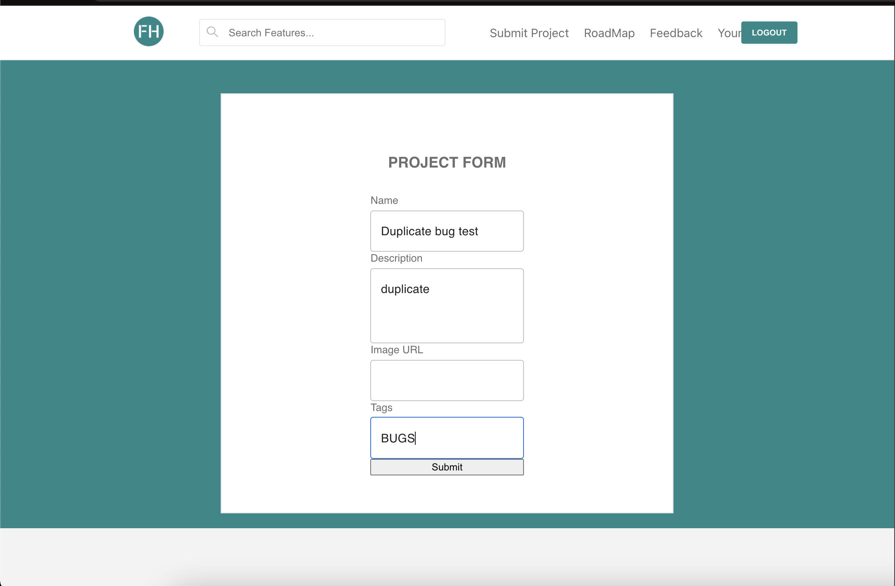
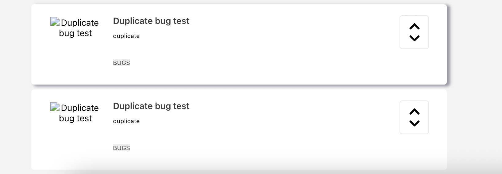
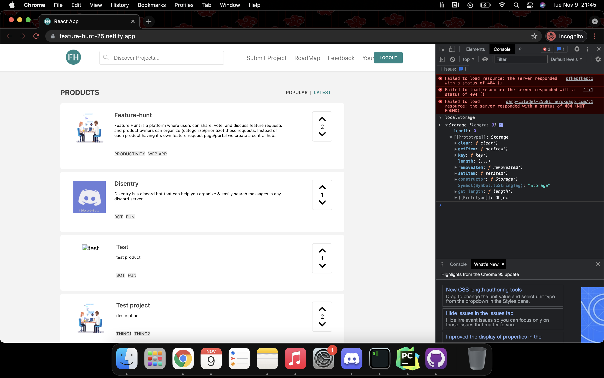
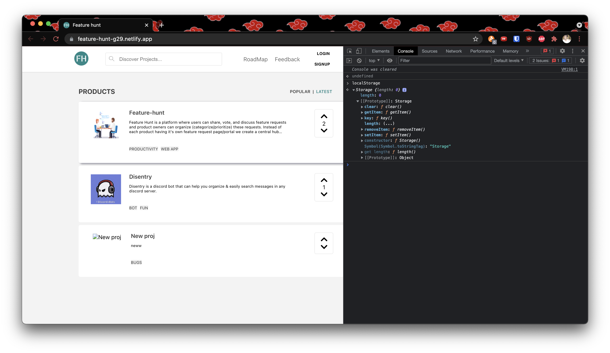

# Updates made in Phase 3 ✨

## Bug Fixes 🐛

* Up vote feature was breaking the UI
<table>
    <tr>
        <th>Phase 2</th>
        <th>Phase 3</th>
    </tr>
    <tr>
        <td>
            before upvoting
        
        </td>
        <td>
            before upvoting 
            
        </td>
    </tr>
      <tr>
        <td>
            after upvoting in phase 2
        
        </td>
        <td>
            after upvoting in phase 3 
            
        </td>
    </tr>
  </table>

* On submitting the project form, duplicate projects are created
<table>
    <tr>
        <th>Phase 2</th>
        <th>Phase 3</th>
    </tr>
    <tr>
        <td>
            Submission form
        
        </td>
        <td>
            No duplicates are formed
        
        </td>
    </tr>
      <tr>
        <td>
            Submitted Project
        
        </td>
        <td>
        </td>
    </tr>
  </table>

* User is shown as logged in even without creating an account
<table>
    <tr>
        <th>Phase 2</th>
        <th>Phase 3</th>
    </tr>
    <tr>
        <td>
            User is automatically logged in
        
        </td>
        <td>
            User needs to create an account first
        
        </td>
    </tr>
  </table>
## New features and Enhancements 🎉

