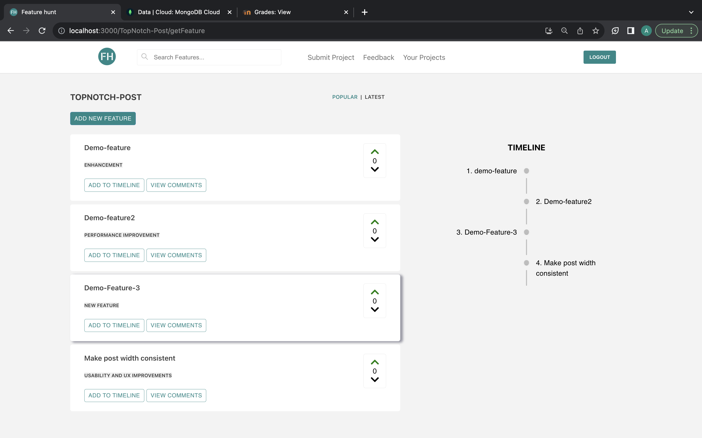
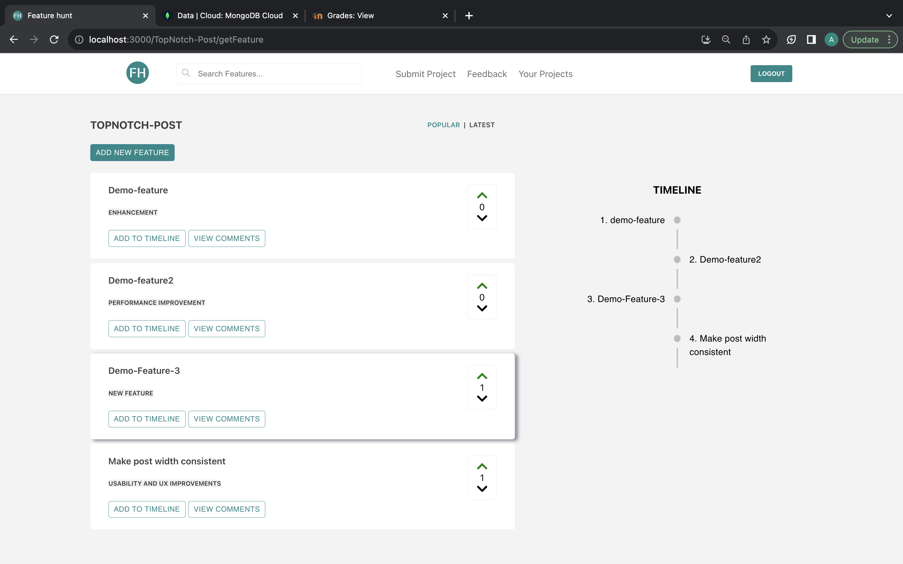
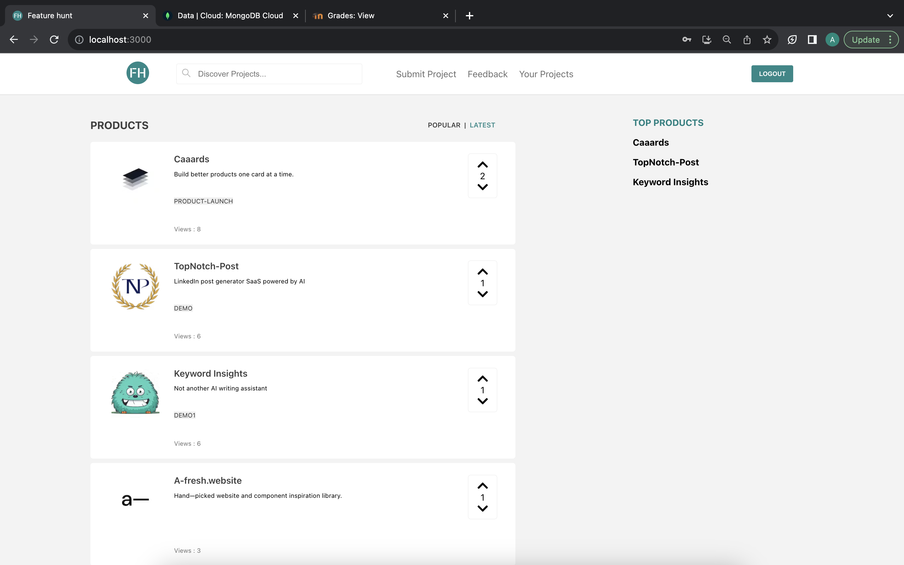
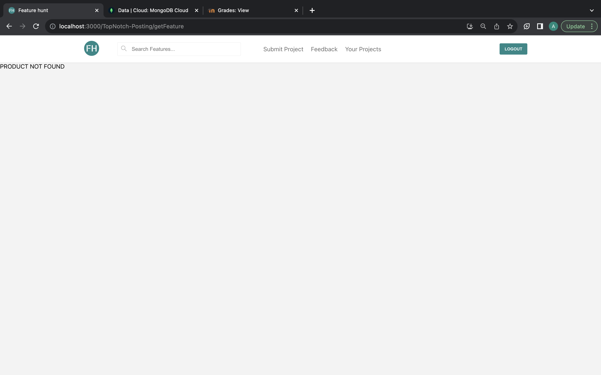
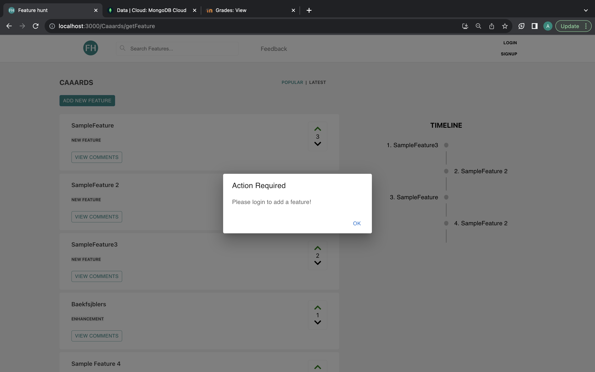

# Updates Made In Phase 3 ✨

## Bug Fixes 🐛

* Fixed the upvote/downvote for Features 
<table>
    <tr>
        <th>Phase 3</th>
        <th>Phase 4</th>
    </tr>
    <tr>
        <td>
            before upvoting
        
        </td>
        <td>
            before upvoting 
            
        </td>
    </tr>
      <tr>
        <td>
            after upvoting in phase 3
        
        </td>
        <td>
            after upvoting in phase 4 
            
        </td>
    </tr>
  </table>

* Fixed the upvote/downvote for Products 
<table>
    <tr>
        <th>Phase 3</th>
        <th>Phase 4</th>
    </tr>
    <tr>
        <td>
            before upvoting
        
        </td>
        <td>
            before upvoting 
            
        </td>
    </tr>
      <tr>
        <td>
            after upvoting in phase 3
        
        </td>
        <td>
            after upvoting in phase 4 
            
        </td>
    </tr>
  </table>
  
* Fixed url manipulation bug which used to display non-existent products
<table>
    <tr>
        <th>Phase 3</th>
        <th>Phase 4</th>
    </tr>
    <tr>
        <td>
            Can view non existing projects
        
        </td>
        <td>
            Getting an error if we manipulate the url
        
        </td>
    </tr>
  </table>

<!-- * On submitting the project form, duplicate projects are created
<table>
    <tr>
        <th>Phase 3</th>
        <th>Phase 4</th>
    </tr>
    <tr>
        <td>
            Can create duplicate projects
        
        </td>
        <td>
            Duplicate creation shows error
        
        </td>
    </tr>
  </table> -->

* Restricted the add feature functionality to logged in users
<table>
    <tr>
        <th>Phase 3</th>
        <th>Phase 4</th>
    </tr>
    <tr>
        <td>
            User not logged in
        
        </td>
        <td>
            User can suggest feature
        
        </td>
    </tr>
     <tr>
        <th>Phase 3</th>
        <th>Phase 4</th>
    </tr>
    <tr>
        <td>
            User not logged in
        
        </td>
        <td>
            User cannot suggest feature
        
        </td>
    </tr>
  </table>

*  Fixed the non clickable projects under “Your Projects”
<table>
    <tr>
        <th>Phase 3</th>
        <th>Phase 4</th>
    </tr>
    <tr>
        <td>
            User cannot click on products
        
        </td>
        <td>
            User can click on products
        
        </td>
    </tr>
  </table>

