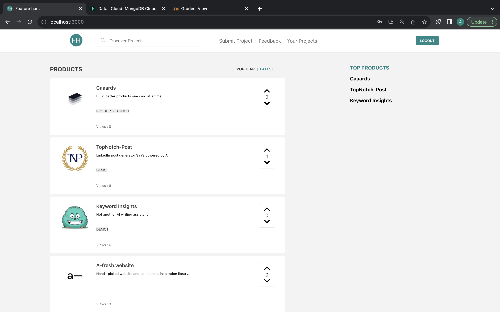
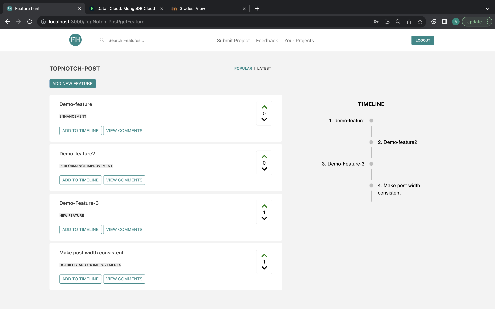
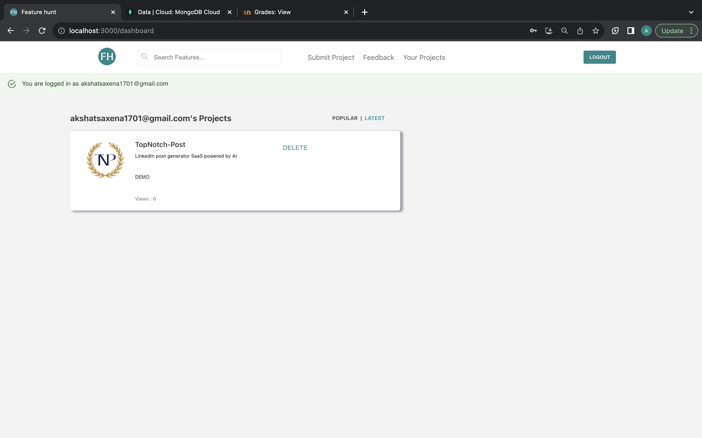

<p align="center">

</p>


[](https://zenodo.org/badge/latestdoi/426076067)

[](https://www.javascript.com)
[](https://github.com/prettier/prettier)
[](https://docs.docker.com/compose/)


[](https://github.com/msethi13/feature-hunt/actions/workflows/nodejs_tests.yml)
[](https://github.com/msethi13/feature-hunt/actions/workflows/codeql-analysis.yml)
[](https://github.com/msethi13/feature-hunt/actions/workflows/pylint.yml)

Feature Hunt is a platform designed to empower you to make better product decisions. It achieves this by providing the means for product owners to seamlessly collect, analyze, and organize feedback and feature requests within their product's dedicated feedback board and presenting the upcoming features to other users in the form of a timeline of release date.

## What it Does

- 🚀 Allows users to easily share their feedback and feature requests on a dedicated platform.
- 📊 Enables product owners to efficiently analyze and organize user-generated feedback.
- 📈 Employs algorithms to calculate product views, helping identify trending products.
- 📆 Allows product owners to add a timeline of feature releases to keep users informed.
- 👀 Enables users to view the feature release timeline.
- 📬 Notifies users when a feature they suggested is added to the timeline.
- 📬 Notifies users when new feature suggestions by other users are added to products they created.
- 📧 Ensures email notifications are up to date and correctly merged for user convenience.
- 💬 Facilitates collaborative conversations using the discussion forum for each product.

## Phase 4 Features implemented

- 📊 Calculated the views of products and listed trending products based on it.
- 🕒 Added the Feature Timeline functionality.
- 📩 Added functionality to notify the user if any feature they suggested was added to the timeline of that product.
- 📩 Added functionality to notify the user if a new feature suggestion was added to any product they created.
- 💬 Added new functionality of a discussion forum for features.
- 📋 Added new functionality to add features with the help of a form.

## Bugs fixed

- 🐞 Fixed the upvote/downvote for Products.
- 🐞 Fixed the upvote/downvote for Features.
- 🐞 Fixed URL manipulation bug which used to display non-existent products.
- 🐞 Fixed a bug that was letting us add projects with duplicate names.
- 🐞 Restricted the add feature functionality to logged-in users.
- 🐞 Refactored product upvote/downvote code.
- 🐞 The projects listed after clicking on "Your Projects" are now clickable.
- 🐞 Fixed the issue of non-clickable projects under "Your Projects."

[Additional details can be viewed here](/Phase_3_Docs/deltaDocument.md)

## Rubric
Can be viewed [here](https://github.com/msethi13/feature-hunt/blob/main/docs/Project%202%20Grading%20Rubric%20-%20Sheet1.csv)
## Preview
 - Homepage
  
 - Products Page
  
 - Features and Timeline Displayed Page
   
 - Your projects Page
  

## Link to Phase 4 Video: 
[Click here to view video](https://www.youtube.com/watch?v=gZ2k6g4rDa0)

We have used the following technologies were used for the development of this project:  
<p align="left">
  <a href="https://www.reactjs.org" target="_blank">
    
  </a>
  <a href="https://www.javascript.com" target="_blank"> 
    
  </a> 
  <a href="https://www.mongodb.com" target="_blank"> 
    
  </a>
  <a href="https://developer.mozilla.org/en-US/docs/Glossary/HTML" target="_blank"> 
    
  </a>
  <a href="https://www.python.org" target="_blank"> 
    
  </a>
  <a href="https://developer.mozilla.org/en-US/docs/Glossary/CSS" target="_blank"> 
    
  </a>
</p>  

## Installation Steps
There are two ways to install and develop for featurehunt 

1. Using Docker

2. Using Local machine

## Installation With Docker.

#### 1.  Follow the steps to install Docker for your OS
```
https://docs.docker.com/get-docker
```
#### 2. Git clone the Repository using 
```
git clone https://github.com/elric97/feature-hunt.git
```
#### 3. In the following files, make the changes:
```
auth_controller.py - change the redirect url to 6060
service.js - change the redirect url to 6060
```
#### 4. Run the following commands
```
cd feature-hunt

docker-compose up --build (This is only needed when you're running the project for the first time. Upon building once, you can run this command without providing --build option)
```

This will run two docker containers. The frontend will run on port 3000 and the backend will run on port 6060

## Installation in Local Machine without Docker.

### First Time Setup

#### 1. Git clone the Repository using 
```
git clone https://github.com/msethi13/feature-hunt.git
```
#### 2. Run the following Commands
```
cd feature-hunt
```
>Optional: In the project directory run `git config --local core.hooksPath hooks` to make sure you have access to the Git Hooks.
Run the following commands in order:

#### 3. `npm install`

Installs the dependencies for the React App

#### 4. `pip install -r backend/requirements.txt`

Installs the requirements for the Flask API

#### 5. `yarn start`

Runs the frontend React app in the development mode.\
Open [http://localhost:3000](http://localhost:3000) to view it in the browser.

The page will reload if you make edits.\
You will also see any lint errors in the console.

To run backend flask api in development mode:  
 
 export DB_PATH='Your mongoDb connection URL'

#### 6. `yarn start-api`

Runs the backend flask API in development mode.\
The API runs on [http://localhost:5000](http://localhost:5000).

Requests made to [http://localhost:3000](http://localhost:3000) that don't exist on the react server are automatically forwarded to this API

## Connecting with a Database

> We use Mongo Cloud Atlas for our project as we find it very convenient. You may choose to use a local mongodb instance or run a docker container

In the file db_init.py - insert the mongo connection url

#### Update :
> Connecting with DB - We have introduced an environment variable DB_PATH, to make sure that you set it to your local or deployed environment

## Other Available Scripts

### `yarn test`

Launches the test runner in the interactive watch mode.\
See the section about [running tests](https://facebook.github.io/create-react-app/docs/running-tests) for more information.

### `yarn lint`

Applies Prettier to all .js files.

### `yarn build`

Builds the app for production to the `build` folder.\
It correctly bundles React in production mode and optimizes the build for the best performance.

The build is minified and the filenames include the hashes.\
Your app is ready!

## Contributors 

<table>
  <tr>
    <td>Group 21</td>
    <td align="center"><a href="https://github.com/bhavya180301/"><br /><sub><b>Bhavya Harchandani</b></sub></a></td>
    <td align="center"><a href="https://github.com/msethi13/"><br /><sub><b>Mitali Sethi</b></sub></a><br /></td>
    <td align="center"><a href="https://github.com/saxena1701/"><br /><sub><b>Akshat Saxena</b></sub></a><br /></td>
    <td align="center"><a href="https://github.com/sid-ncsu/"><br /><sub><b>Siddharth Shah</b></sub></a><br /></td>
  </tr>
  </table>


## Contribution
Please refer the CONTRIBUTING.md file for instructions on how to contribute to our repository.

## License
This project is licensed under the MIT License.

## Future Scope
- Can add frontend for Image Upload
- Allow user to edit their own comments (on the comments page of feature)
- Add dates to the feature timeline
- Feature being displayed after first refresh when clicked on searched product.
- Features page of a product does not display features directly (without reload) when the product is found through Search

# Funding Information
This project has not yet been funded by any source

## Support
For any concerns and queries, please send an email to [seproject37@gmail.com](seproject37@gmail.com)
